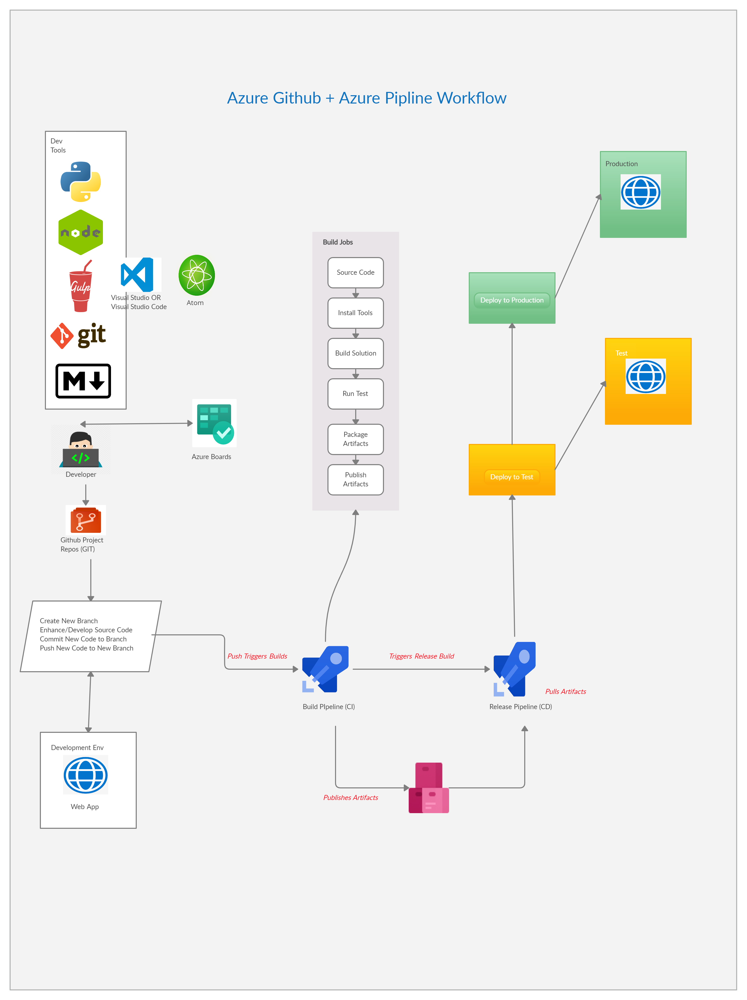
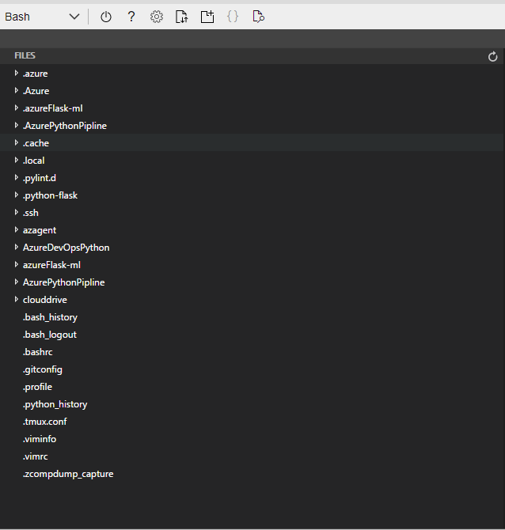
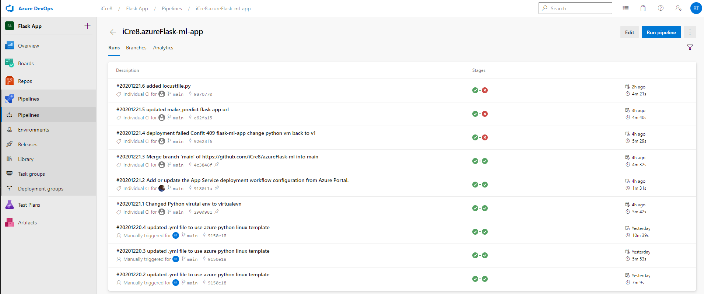
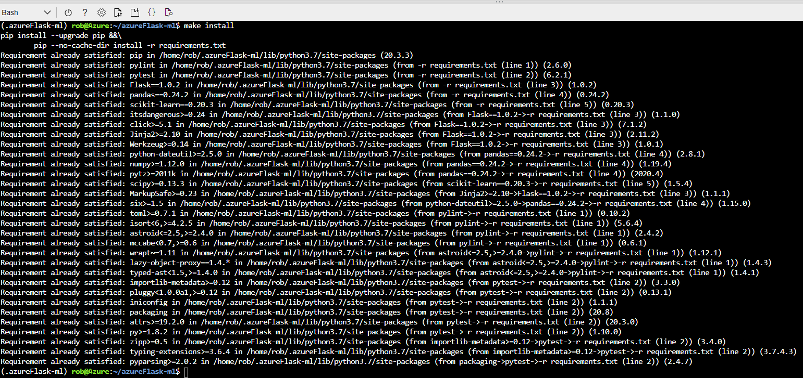
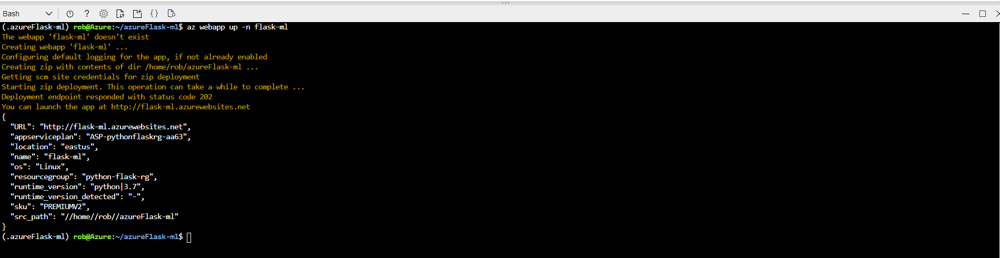
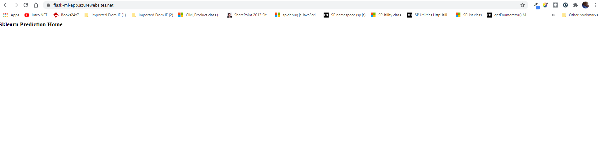
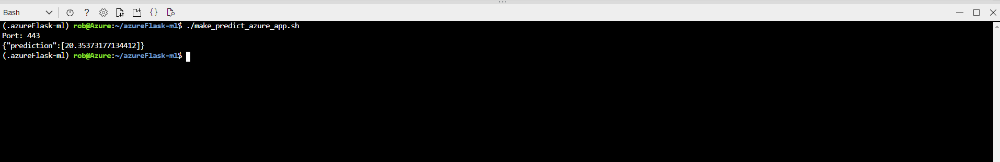

# Overview

## Github Action 


## Azure Pipeline Status 


Azure Cloud Shell environment and that build, test, deploy, a Python Flask Machine Learning application. The project uses Flask, sklearn, Makefile, azure-pipelines, github actions and locustFile testing tool.

Project Planning tools includes Trello and Excel Spreadsheets for planning and execution of project deliverables.

## Project Plans 

[Azure Pipeline Project Trello](https://trello.com/b/6obahJRP/azure-piplines)

[Azure Pipeline Project Spreadsheet](https://docs.google.com/spreadsheets/d/1PCDJgYve5tpazcsaU8GRSRarUgYvU2487QDgchKcLRA/edit?usp=sharing)

## Instructions
This project is broken up into multiple technological disciplines with DevOps being the most overaching topic. 
**Github Actions** is the build server that will run test on the code were building using pylint. 
**Azure Portal**, **Azure Cloud Shell** and **Azure CLI** is used to host the application service as well as the **Azure DevOps** Continuous Intergration and Continuous Delivery Pipline (CI/CD). 

### Project Architecture 


### Getting Started

1. Create an [Azure Account](https://portal.azure.com/)  
    1.1 Once the Azure Account is created, login to the portal and type Azure DevOps
    1.2 Click **Azure DevOps organization** and create an orgnaization for your project 
2. Install the [Azure Command line ineterface](https://docs.microsoft.com/en-us/cli/azure/install-azure-cli?view=azure-cli-latest) (Optionally, for running az commands locally)
3. Clone this repo (Optionally, for running az commands locally)
    3.1. `cd into the repo` 
    3.2. Open your favorite IDE in where the cloned repo files are located
4. Navigate to the Azure portal and login. On the top navigation click the firt icon on the right side of the search box that looks similar to [>_]. This will open **Azure Cloud Shell**
5. `git clone <repo-name>`
6. cd in the cloned repository 
7. Create a virtual env in the home directory `viurtalenv ~/.<your-virutalenv-name>`
8. Activate the virtual environment `source ~/.<your-virtualenv-name>/bin/activate`
9. On the **Azure Cloud Shell** window click the icon {} with two curly braces to open the Editor
10. Navigate the the cloned repository you created, open the app.py file
11. With app.py open located the `@app.route("/") function and change the text in between the html <h3> tags` and save the file 
    11.1 Run 
    ```git add . 
       git commit -m "i-changed-stuff"
       git push
    ```
    11.2 Navigate to the [Azure DevOps Organization](https://portal.azure.com/#blade/AzureTfsExtension/OrganizationsTemplateBlade) Created in step 1.2
    11.3. Navigate to Pipelines. Here you will see the build being created from the git push
    **For official documentation on setting up your Pipeline see** 
  [Azure Pipeline CI/CD](https://docs.microsoft.com/en-us/azure/devops/pipelines/ecosystems/python-webapp?view=azure-devops).
12. run `make install` 
13. run `az webapp up -n <your-webapp-name>
14. Navigate to the url out `http://<your-app-name>.asurewebsites.net`
15. You should see changes made to the title heading in the output
16. Navigate back to the the **Azure Cloud Shell** 
17. Run `chomd 777 ./make_predict_azure_app.sh` to change execution permissions
18. Run `./make_predict_azure_app.sh` 


## Output from steps 9 - 18

### Step 9: Editor Open in Azure Cloud Shell


### Step 10: Cloned Repository in Azure Cloud Shell


### Step 11.3: Build Deployment Azure Pipeline in Azure DevOps Organization


### Step 12: Azure Cloud Shell


### Step 13: Azure WebApp in Azure Cloud Shell


### Step 14 - 15: Browse to Application in Azure Portal


### Step 16 - 18: Make predict execution in Azure Cloud Shell


## Application Enhancements
1. Create a user input field to allow users to enter values 
2. Add HTML5 & CSS3 formatting to pages to center the input field 
3. Add Descriptive Text to explain the project details with optional github links
4. Add about us or about app page to educate the user 
5. Allow multiple data types selection for the prediction algorithm 
6. Use predicition alogorithm backend to remove script dependancies 

## Demo 

<TODO: Add link Screencast on YouTube>


